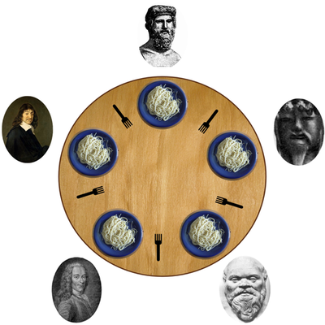
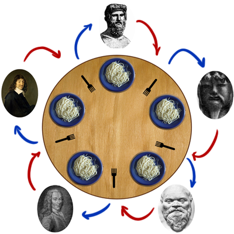
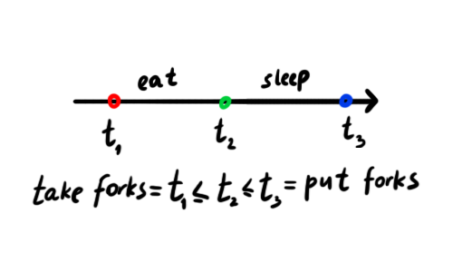
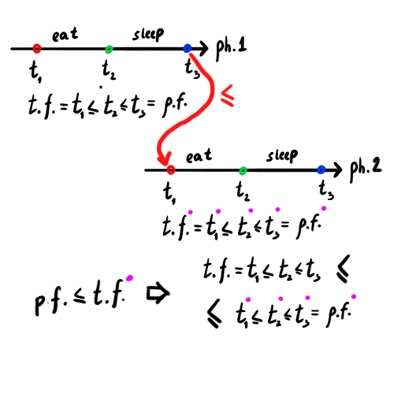

# philosophers

### Introduction

`Dining philosophers problem` is a classical one in CS and
in concurrent algorithm design in particular. It states as following:

> Five silent philosophers sit at a round table with bowls of spaghetti. Forks are placed between each pair of adjacent philosophers.

<p align="center">
  
</p>

> Each philosopher must alternately think and eat. However, a philosopher can
> only eat spaghetti when they have both left and right forks. Each fork can
> be held by only one philosopher and so a philosopher can use the fork only
> if it is not being used by another philosopher. After an individual
> philosopher finishes eating, they need to put down both forks so that the
> forks become available to others. A philosopher can only take the fork on
> their right or the one on their left as they become available and they cannot
> start eating before getting both forks.

> Eating is not limited by the remaining amounts of spaghetti or stomach space;
> an infinite supply and an infinite demand are assumed.

> The problem is how to **design a concurrent
> algorithm such that no philosopher will starve**; i.e., each can forever
> continue to alternate between eating and thinking, assuming that no
> philosopher can know when others may want to eat or think.

For more information check [wikipedia](https://en.wikipedia.org/wiki/Dining_philosophers_problem).

**Today we are going to speak in terms of philosophers-threads and forks-mutexes.**

### Problem statement

The general rules are the same as above except these:
* number of philosophers is parameterized
* philosopher eats and sleeps for a constant amount of time passed as program parameters
* philosopher falls asleep as soon as they finished eating
* `time_to_die` is time philosopher can survive with no food. Time is counted 
 from last eating **begin** time. (e.g. is if `time_to_eat = 100`
 and `time_to_die = 50` the philosopher dies during eating, also they can die
 in their sleep with parameters `time_to_die = 150`, `time_to_eat = 100`,
 `time_to_sleep = 100`)
* the programme should work as a simulation
* philosopher dies ⇒ simulation stops
* some limitations on using libc function

Check the original task [here](https://projects.intra.42.fr/projects/42cursus-philosophers).

### Purposes 
There are two main points of complexity in comparison with original problem:
1. the philosopher can eat and sleep not as long as they wants and must do everything in time
2. the philosopher can die due to inappropriate input (not because of deadlock)


According to the facts above and unwillingness to rely on inaccurate 
`usleep` to sync philosophers' actions (it was supposed by the task, btw)
I had to use some tricks

### Solution


#### General overview
One fork — one mutex, one philo — one thread. 

#### Deadlock safety
Let the forks be numbered in circle `1, 2, ..., n` and
red arrow means "philosopher holds a fork" and blue one means
"philosopher is stuck on trying to pick up a fork". _Deadlock_ happens
if and only if cycle in a graph happens.

<p align="center">
  
</p>

To avoid such situation each philosopher should respect the rules:
* the first fork to take is a fork with a **smaller number**
* put down forks in a **reverse** order (i.e. **bigger** fork first)

#### Eating order
Split philosophers in two equal groups `EVEN` and `ODD` (and group `EXTRA`
with 1 philosopher if the number of philosophers is odd).
`EVEN` eat first, then `ODD` and then `EXTRA`
(if exist). The mechanism is encapsulated in `fork`s — mutex-like types.

#### Time sync
It is obvious that having a particular order in which philosophers should eat
we set a [linear order](https://en.wikipedia.org/wiki/Total_order) on a set
of events (every start/end of eating, sleeping, thinking form a set of _events_).

Let's check it. Here's the order on one philosopher's actions.

<p align="center">
  
</p>

According to the order on fork (i.e. put the fork by philosopher
1 is earlier then take the fork by philosopher 2) we can produce
a linear order.

<p align="center">
  
</p>

After that, forks can be used for time sync by each philosopher.
Each philosopher tries to do something like that:

0. Init local timer `= 0`
1. Try take first fork
3. If not success goto `1.`
4. Try take second fork
5. If not success put fown first fork and goto `1.`
4. Update local timer `= MAX(timer, MAX(ts on fork1, ts on fork2))`
5. Eat, update local timer according to `time_to_eat`
6. Put second fork (and set its time to local timer)
7. Put first fork (and set its time to local timer)
8. Sleep, update local timer according to `time_to_sleep`
9. goto `1.`

In fact it is a bit more complicated because of
some corner cases and the order in which philosophers
are permitted to take forks. 

#### Stopping the simulation
Nothing can be printed after the philosopher dies or every philosopher ate
defined amount of times. After that we need some queue-like thread-safe data 
structure to `ev_enqueue()` events from threads; `ev_dequeue()` and handle them in
the main thread. Lock-free circular queue was selected.


### Implemetation


### Usage
```zsh 
make
# ./philo num_of_ph time_to_die time_to_eat time_to_sleep [number_of_eat]
# Last parameter is optional, can be used to limit the simulation time
./philo 5 400 200 200
```

### Further exploration
How to implement lock-free non-circular queue — [link](http://citeseerx.ist.psu.edu/viewdoc/download?doi=10.1.1.53.8674&rep=rep1&type=pdf).
